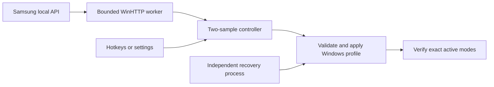

# Architecture

The UI thread owns all decisions and display operations. One worker performs a single asynchronous HTTP request at a time and publishes samples in order through a bounded 16-entry queue. Overflow pauses automation. Generation numbers exclude obsolete settings; stale samples reset debounce rather than count as consecutive replies. Polling stops while explicitly paused or during a timed picture trial/transactional save. Settings alone do not pause polling. Observation epochs invalidate requests issued before a manual/resume/trial transition.

The worker uses a fixed 500 ms cadence and waits between requests. A 200 ms deadline covers the complete response, not just an individual socket read. Callback context stays alive until WinHTTP confirms request-handle closure. Unexpected HTTP status and invalid content are distinct from network unavailability.

Profiles store captured source/target modes and semantic hardware identity. Mode records retain exact native timing details, but old runtime LUIDs and source/target IDs are overwritten with live IDs before validation. Candidate paths come from QueryDisplayConfig; targets must be available, unambiguous and on the configured connector. Desktop origin becomes 0,0 for a single screen.

Before a display write, the preceding desktop is saved privately and the same EXE starts in recovery mode. It acknowledges readiness before the main process applies a profile. The guard restores a nonempty validated recovery profile after 10 seconds unless verification removes its pending record. A verified monitor has priority over TV-only prior output. Cancelled guards exit promptly; guards retry a busy display lock. Windows driver calls are not cancellable. Visual setup trials use 30 seconds. Recovery is temporary; there is no permanently resident second controller.

Autostart uses a hidden per-user interactive Task Scheduler logon task for the real executable and --auto. A temporary task must launch the same EXE and write a unique readiness receipt before enabling startup. Configuration failures roll back registration. --startup-off removes this app's task and legacy Run value. No elevation is used. The application is a Windows GUI executable with a hidden command window; it never opens a console or tray icon for background startup.

Local configuration is versioned and written by temporary-file replacement. There is one instance per user/session and a shared display-switch mutex. A second invocation delivers commands to the hidden host. Local status and two rotating log files contain errors rather than displaying unattended popup dialogs.

## Advanced commands

Manual selection probes the current network state, then holds the chosen profile while polling continues. Two on replies, explicit off, or two network failures establish a stable state. A change from the manual baseline releases the hold. With an unknown baseline, the first stable state establishes it without switching. Display notifications and stale samples must not clear this hold. Explicit --auto clears it. Explicit pause and safety errors suspend switching; normal settings stay active. Blocked TV commands restore the previous pause state.

An optional `portable.flag` beside the executable selects `data/` there instead of LocalAppData. This allows the host and Explorer to share real paths when a packaged host redirects AppData writes. Private data must remain outside the public repository. A shell's file-existence check alone does not prove that Explorer or Windows logon startup can access an installation.

- `--trial-tv`, `--trial-monitor`: timed physical trials before background host startup.
- `--import-prototype <folder> <private-ip>`: one-time import of the original PowerShell profiles. Requires both original visual confirmations and a live, identified Samsung reply. The importer does not switch displays.
- `--rollback <private-pending-file>`: internal recovery process; not a user-facing configuration option.

Use `--settings` for normal adaptation. Never copy another person's live configuration into a public example. More than two configured displays and arbitrary macro execution are deliberately excluded.
